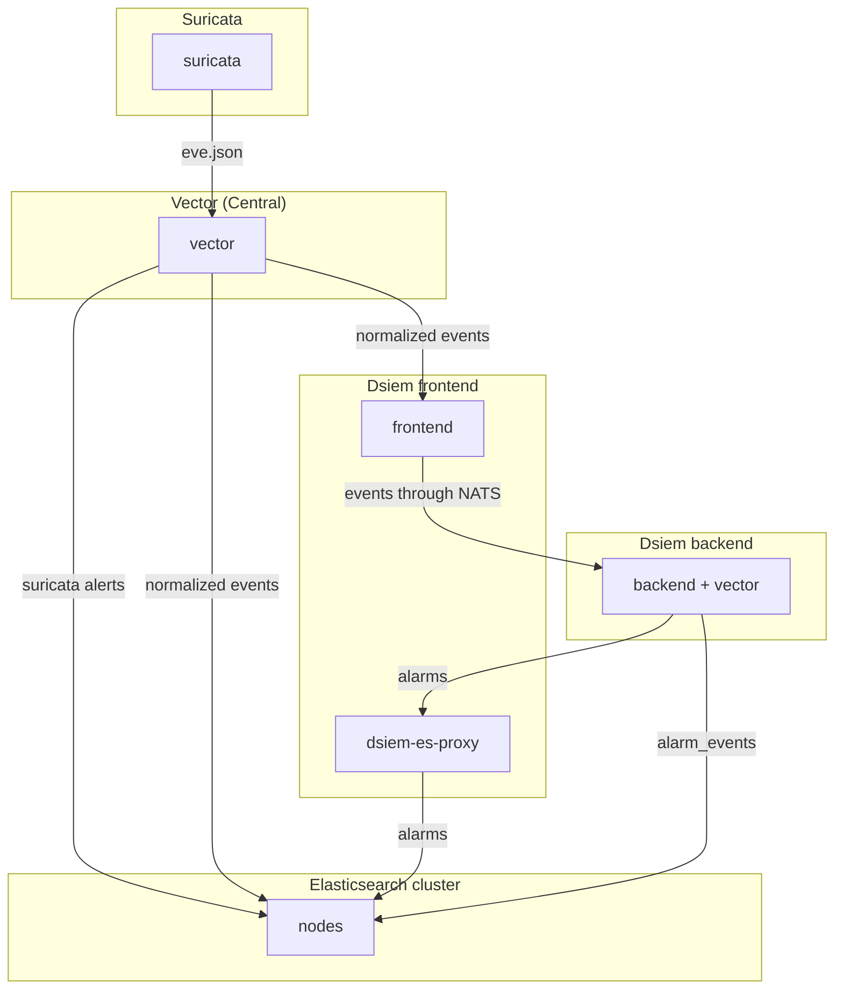

# Dsiem ES proxy

This tool replaces Logstash in Dsiem architecture by:

- Implementing the [scripted upsert](https://www.elastic.co/guide/en/elasticsearch/reference/current/docs-update.html#scripted_upsert) functionality in [80_siem.conf](https://github.com/defenxor/dsiem-rs/blob/90945c2f5d5be15070b74d5a71f7dca6eff919ea/deployments/docker/conf/logstash/conf.d/80_siem.conf#L119), which is meant to avoid inserting duplicate entries for the same alarm into Elasticsearch.

- Upserting the default `siem_alarms` [index template](https://github.com/defenxor/dsiem-rs/blob/master/deployments/docker/conf/logstash/index-template.d/es7/siem_alarms-template.json) to Elasticsearch when there isn't one already exist.

An example of Dsiem architecture that completely replaces Logstash with [Vector](https://vector.dev/) is shown in the diagram below. There is a docker compose deployment for it in [here](./examples). The vector config files in particular have comments that further explain the setup.



## How to test the example

- Clone this repo:

  ```shell
  git clone https://github.com/mmta/dsiem-esproxy.git
  ```
- Start the docker compose environment (replace `eth0` with appropriate network interface):
  ```shell
  cd examples/
  export PROMISC_INTERFACE=eth0
  docker compose up
  ```
- From another terminal in the same host, install Kibana dashboard:
  ```shell
  cd examples/
  ./kbndashboard-import.sh localhost ./kibana/dashboard-siem.json 
  ```
- From another terminal in the same host, ping an external IP, and make sure the traffic goes through that network interface (e.g. `eth0`).
  ```shell
  ping 1.1.1.1
  ```
- Open Kibana dashboard from http://localhost:5601, and verify that ping related alarms are created in the Dsiem dashboard.

## Misc Info

- Docker image is available from [dockerhub](). Refer to the compose example on how to use it, and the CLI `--help` parameter to see all the valid arguments.

- Use or review the [Dockerfile](./Dockerfile) on how to build the project.
  ```shell
  docker build . -t mmta/dsiem-esproxy
  ```

- Future development _**may**_ involve:
  - An HTTP GET `/alarms` endpoint that gives a JOIN'ed view of an alarm and its associated events. This will simplify access from other tools (including Dsiem UI) to the alarm records, and with caching, should help in lowering Elasticsearch load.
  - Integrate `dsiem-es-proxy` functionality into dsiem frontend.
