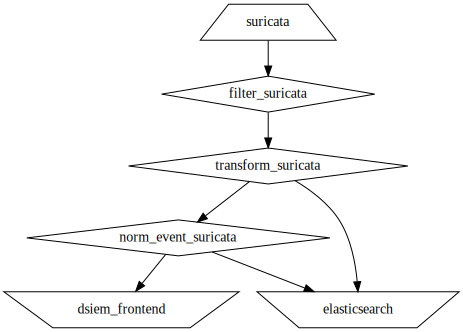
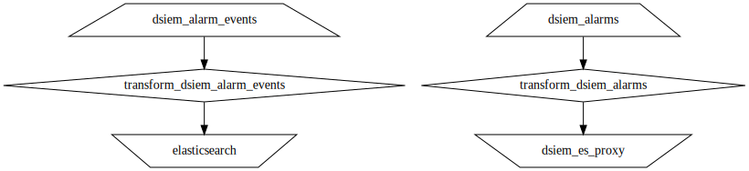

# Dsiem deployment with Vector

Docker compose environment for Dsiem that uses vector instead of Logstash. The vector processing flow for the central node is given in the image below, which was produced using this command:

```sh
docker exec vector vector graph --config-dir /etc/vector/ | dot -Tsvg > graph-central.svg
```


And for the side-car vector:

