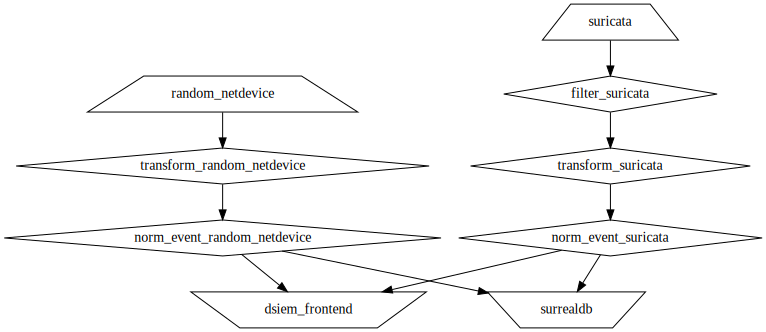
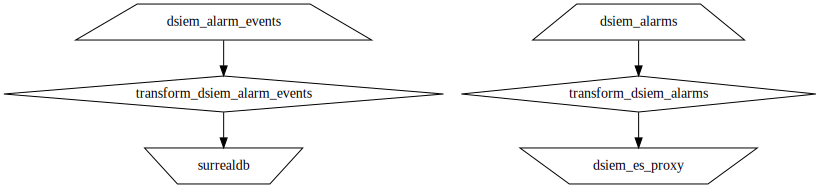

# Dsiem deployment with Vector

This directory stores two Docker compose environment:

- [compose.yml](./compose.yml): Dsiem environment that uses vector and surrealdb, instead of Logstash & Elasticsearch.
- [compose-with-es.yml](./compose-with-es.yml): also uses vector and surrealdb, but also stores copy of alarms in Elasticsearch.

The vector configs are the same. Processing flow for the central node is given in the image below, which was produced using this command:

```sh
docker exec vector vector graph --config-dir /etc/vector/ | dot -Tsvg > graph-central.svg
```


And for the side-car vector:




## Example queries

- Get all alarms with events:
  
  ```sql
  SELECT alarm_id, title, risk_class, (SELECT event, stage FROM alarm_event WHERE alarm = $parent.id) AS events FROM alarm
  ```
  Using `curl` and `jq`:

  ```shell
  curl -s \
    -H 'content-type: application/json' -H 'accept: application/json' \
    -H 'NS: default' -H 'DB: dsiem' \
    -XPOST "http://localhost:8000/sql" \
    -d'select alarm_id, title, risk_class, (SELECT event, stage from alarm_event WHERE alarm = $parent.id) as events from alarm' | jq .
  ```
- Get a specific alarm and specific rule stage:
  ```sql
  SELECT alarm_id, title, risk_class, (SELECT event, stage FROM alarm_event WHERE alarm = $parent.id and stage = 1) AS events FROM alarm where alarm_id="quMQXSHQR"
  ```
  Example output:
  ```json
  [
    {
      "result": [
        {
          "alarm_id": "quMQXSHQR",
          "events": [
            {
              "event": "event:⟨f24a6763-9dbd-4309-b420-f24323684c2e⟩",
              "stage": 1
            }
          ],
          "risk_class": "Medium",
          "title": "Ping Flood from 192.168.144.68"
        }
      ],
      "status": "OK",
      "time": "55.358211ms"
    }
  ]
  ```
- Get all details of the event(s) as well:

  ```sql
  SELECT alarm_id, title, risk_class, (SELECT event, stage FROM alarm_event WHERE alarm = $parent.id and stage = 1) AS events FROM alarm where alarm_id="quMQXSHQR" fetch events.event
  ```
  Result:
  ```json
  [
    {
      "result": [
        {
          "alarm_id": "quMQXSHQR",
          "events": [
            {
              "event": {
                "@timestamp": "2024-04-06T07:16:03.361840551Z",
                "category": "Misc activity",
                "custom_data1": "...f.....^...................... !\"#$%&'()*+,-./01234567",
                "custom_label1": "payload printable",
                "dst_ip": "192.168.100.1",
                "dst_port": 0,
                "event_id": "f24a6763-9dbd-4309-b420-f24323684c2e",
                "id": "event:⟨f24a6763-9dbd-4309-b420-f24323684c2e⟩",
                "index_name": "siem_events",
                "plugin_id": 1001,
                "plugin_sid": 2100384,
                "product": "Intrusion Detection System",
                "protocol": "ICMP",
                "sensor": "9615aa703dba",
                "src_ip": "192.168.144.68",
                "src_port": 0,
                "timestamp": "2024-04-06T07:16:03.155401+0000",
                "title": "GPL ICMP_INFO PING"
              },
              "stage": 1
            }
          ],
          "risk_class": "Medium",
          "title": "Ping Flood from 192.168.144.68"
        }
      ],
      "status": "OK",
      "time": "57.704647ms"
    }
  ]
  ```
